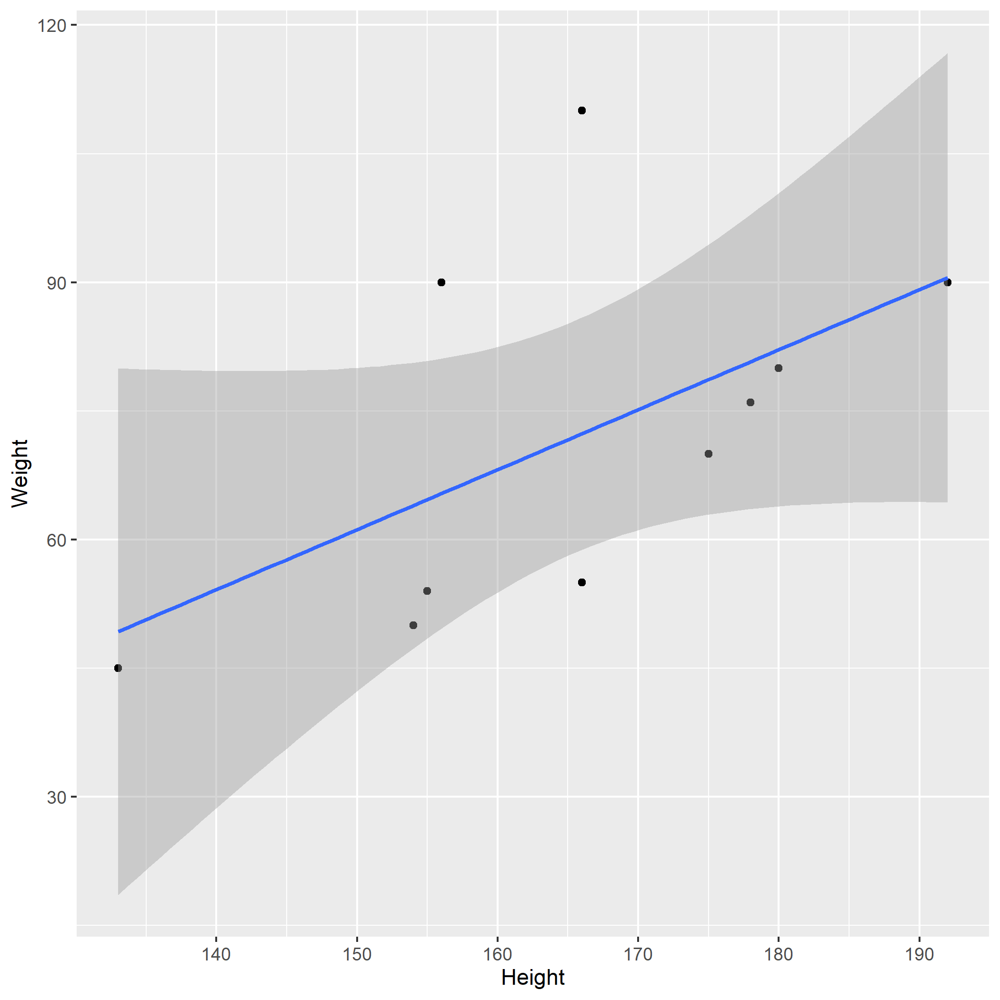
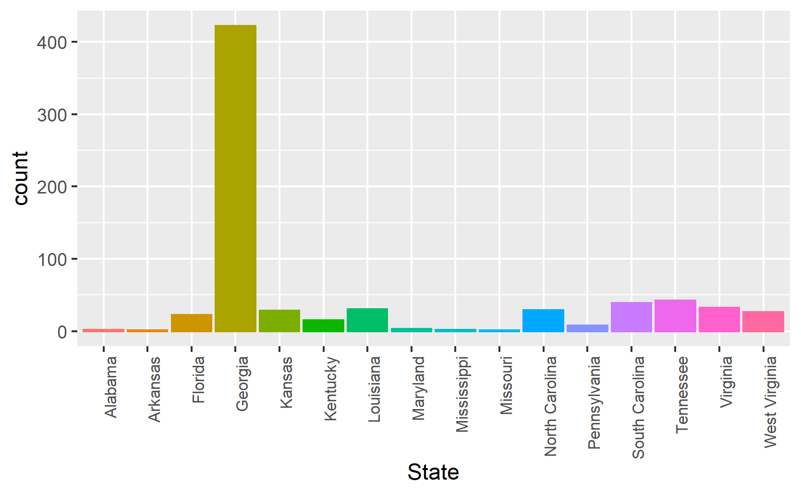
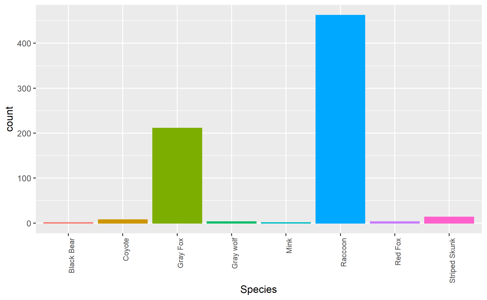

---
title: "Temporal and Spatial Patterns in Distemper Virus Cases Reported to SCWDS 1975-2013"
subtitle: ""
author: Jonathan Wilson
institute: "University of Georgia"
date: "`r Sys.Date()`"
site: bookdown::bookdown_site
documentclass: article
output:
  bookdown::word_document2: 
    toc: false
   
bibliography: ../references.bib
csl: ../apa.csl
 always_allow_html: true
 ---
 
```{r}
library(ggplot2)
library(plotly)
```

# Summary/Abstract
Canine distemper is an important infectious disease that affects many mammal species.  There is evidence of CDV infection in all terrestrial carnivores families and some marine carnivore families. CDV has been detected in wild animal species such as the African lion and Amur tigers and has been responsible for substantial population declines of the animals during outbreaks.
First seen in domestic dogs in the late 1970’s, CDV spread through the population rapidly (Alison et al 2013). CDV is seen most commonly in domestic cats and dogs but frequent cross species transmission does occur in non-domestic carnivores. In domestic ferrets mortality rates can reach 100%. CDV has been responsible for population declines of endangered mustelids like the black-footed ferret. CDV is also endemic in the eastern U.S. raccoon population. Raccoons are thought to be a reservoir for other wild animals and domestic dogs as well as other species of carnivores. CDV has been found to be persisting in areas like Yellow Stone national park, which has a diverse carnivore population. Multiple outbreaks have occurred in the wolf, coyote and cougar populations 
Although raccoons are thought to be a major reservoir for CDV, little research has been done to identify the disease dynamics within this population. 


# Illustrating setup
_This section is only there to show how to insert results from other places in the project and how to cite figures and other references. Delete this whole section at some point._


This paper [@Leek2015a] discusses types of analyses. 


Figure \@ref(fig:resultfigure) shows a result figure from the analysis.

#`#``{r resultfigure,  fig.cap='Analysis figure.', echo=FALSE}

#```

Table \@ref(tab:resulttable) shows a result table from the analysis.

#```{r resulttable,  echo=FALSE}
resulttable=readRDS("../../results/resulttable.rds")
knitr::kable(resulttable, caption = 'Result Table.')
#```


Note that this cited reference will show up at the end of the document, the reference formatting is determined by the CSL file specified in the YAML header. Many more style files for almost any journal [are available](https://www.zotero.org/styles). You also specify the location of your bibtex reference file in the YAML. You can call your reference file anything you like, I just used the generic word `references.bib` but giving it a more descriptive name is probably better.


# Introduction (required for part 1)

## General Background Information
Canine distemper is an important infectious disease that affects many mammal species.  There is evidence of CDV infection in all terrestrial carnivores families and some marine carnivore families. CDV has been detected in wild animal species such as the African lion and Amur tigers and has been responsible for substantial population declines of the animals during outbreaks.
First seen in domestic dogs in the late 1970’s, CDV spread through the population rapidly (Alison et al 2013). CDV is seen most commonly in domestic cats and dogs but frequent cross species transmission does occur in non-domestic carnivores. In domestic ferrets mortality rates can reach 100%. CDV has been responsible for population declines of endangered mustelids like the black-footed ferret. CDV is also endemic in the eastern U.S. raccoon population. Raccoons are thought to be a reservoir for other wild animals and domestic dogs as well as other species of carnivores. CDV has been found to be persisting in areas like Yellow Stone national park, which has a diverse carnivore population. Multiple outbreaks have occurred in the wolf, coyote and cougar populations 
Although raccoons are thought to be a major reservoir for CDV, little research has been done to identify the disease dynamics within this population. 


## Description of data and data source
Data was recorded from Canine distemper positive cases submitted to the Southeastern Cooperative Wildlife Disease Study between 1975 and 2013. Cases were identified as CDV by fluorescent antibody testing and/or histologic diagnosis of characteristic lesions.  Species, date of submission, county of origin, and sex were noted. A total number of 702 positive cases were submitted from 13 states over the 38-year period. Positive cases were comprised of raccoons (n=462), gray foxes (n=211), striped skunks (n=13), coyotes (n=7), red foxes (n=3), gray wolves (n=3) and a black bear.

## Questions/Hypotheses to be addressed
1.Are there temporal trends in cases diagnosed related to the ecology of the hosts? eg breeding seasons


2.Are there patterns in the timing of species being diagnosed suggesting cross species infection? (raccoons are considered primary reservoirs, are peaks in raccon infection followed by other species peaks suggesting spillover)


3.Are there spatial patterns of infection within the southeast relating to landuse or other ecological features


# Methods and Results


_In most research papers, results and methods are separate. You can combine them here if you find it easier. You are also welcome to structure things such that those are separate sections._


## Data aquisition
Data of animals brought to SCWDS between 1975 and 2013, which were diagnosed as having CDV at post mortem. Cases were identified as CDV by fluorescent antibody testing and/or histologic diagnosis of characteristic lesions.  Species, date of submission, county of origin, and sex were noted. 
##Overview of Data

```{r}

CDV_Clean <-   readRDS("../../data/processed_data/CDVprocesseddata.rds")


str(CDV_Clean)

```
## Data import and cleaning
Detailed description of data analysis and cleaning in supplemtary folder

## Univariate analysis
Initial probing of the data set revealed the vast majority of cases to be submitted from the state of Georgia. This is understandable as SCWDS is located in Athens. The other feature is that almost all of the submitted cases are Raccoons or Gray Foxes. From this point the data analysis will focus on the state of Georgia and these tow species, Raccoon and Gray Fox.
###Initial Data Probing
```{r}



```
_Use a combination of text/tables/figures to explore and describe your data. You should produce plots or tables or other summary quantities for most of your variables. You definitely need to do it for the important variables, i.e. if you have main exposure or outcome variables, those need to be explored. Depending on the total number of variables in your dataset, explore all or some of the others._

## Bivariate analysis
_Create plots or tables and compute simple statistics (e.g. t-tests, simple regression model with 1 predictor, etc.) to look for associations between your outcome(s) and each individual predictor variable_

##Spatial Mapping of Georgia Data

```{r}
library(ggmap)
library(ggthemes)
RACnum <- readRDS("../../data/processed_data/RaCFoxMappingData.rds")

g1 <- ggplot(data = RACnum, aes(frame = CollectionYear)) +  
  geom_polygon(aes(x = long, y = lat, group = group), fill= "white", color = "azure4") + 
  coord_fixed(1.3)  + 

  theme_map() 

g2 <- g1 + 
  theme( 
  axis.text = element_blank(),
  axis.line = element_blank(),
  axis.ticks = element_blank(),
  panel.border = element_blank(),
  panel.grid = element_blank(),
  axis.title = element_blank(), legend.position = "right")  + labs(fill= "Number of cases") 
centrLL <- readRDS("../../data/processed_data/GACentroiddata.rds")

g3 <- g2 + 
  geom_point(data = centrLL, aes(x = long, y = lat, color= Species), alpha = 0.5, position = position_jitter(width=0.05,height=0.05 ) ) 
 
g4 <- ggplotly(g3) %>% animation_opts( transition= 1,  redraw = FALSE) 
g4


```
## Full analysis

The aim is to produce a time series analysis of the Raccoon and Gray fox data as it is suggested that the virus spills over from raccoons to other species. If this is the case a time delay would be suspected. In Progress...
_Use one or several suitable statistical/machine learning methods to analyze your data and to produce meaningful figures, tables, etc. This might again be code that is best placed in one or several separate R scripts that need to be well documented. You can then load the results produced by this code_

# Discussion

## Summary and Interpretation
_Summarize what you did, what you found and what it means._

## Strengths and Limitations
The major flaw in this data set is that it only contains postive cases. In an ideal world, all cases submitted in this time would be available so that prevalence and icidence could be evaluated. This is also not systematically sampled and is dependent on DNR officers submitted cases.

_Discuss what you perceive as strengths and limitations of your analysis._

## Conclusions
_What are the main take-home messages?_


_Include citations in your Rmd file using bibtex, the list of references will automatically be placed at the end_

# References

